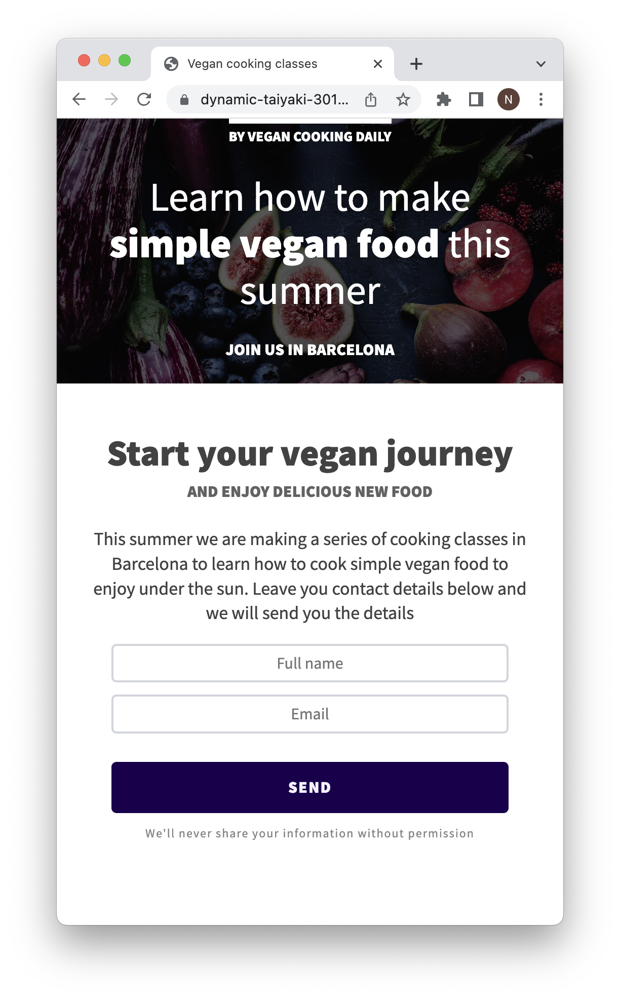

# Cooking class form

Responsive website with a form to sign up for a cooking class

## Features
Users can add their name and email to request more information about the upcoming class. They can open the website on any device.

## Demo

Test it on Netlify: https://cooking-class-form-natalia-davtyan.netlify.app/

## Technologies
The project is built using:
* HTML
* CSS

## Technical details
* Used relative units and media query to make the website responsive.
* Used mobile-first approach.

## Project status
The project is complete.

## Acknowledgements
The core of this project was built during the class on [the Frontend Developer Career Path at Scrimba](https://scrimba.com/learn/frontend) by Guil Hernandez and later edited by me.

## Contact
Created by [Natalia Davtyan](https://github.com/nataliadavtyan)
